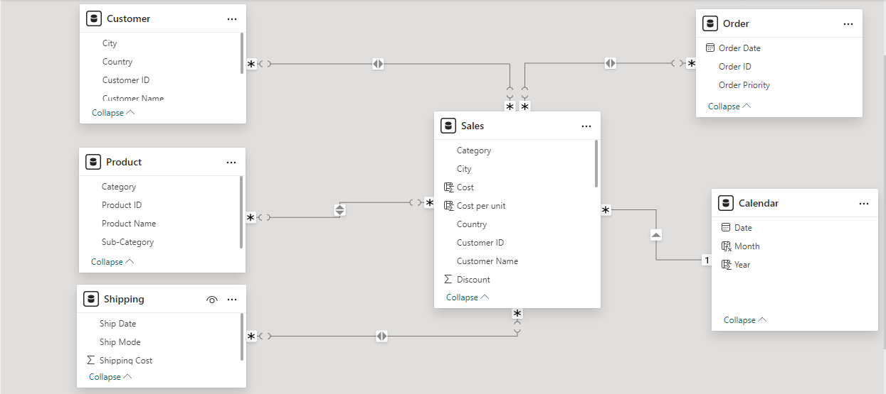
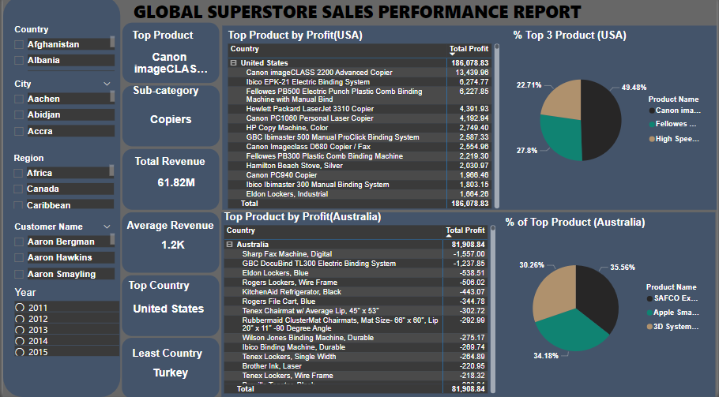
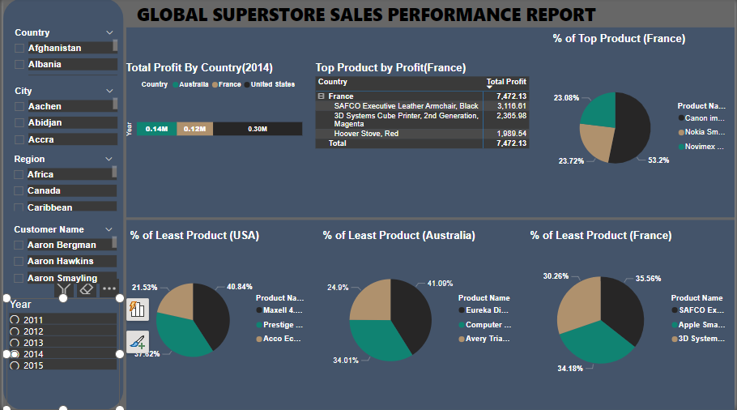
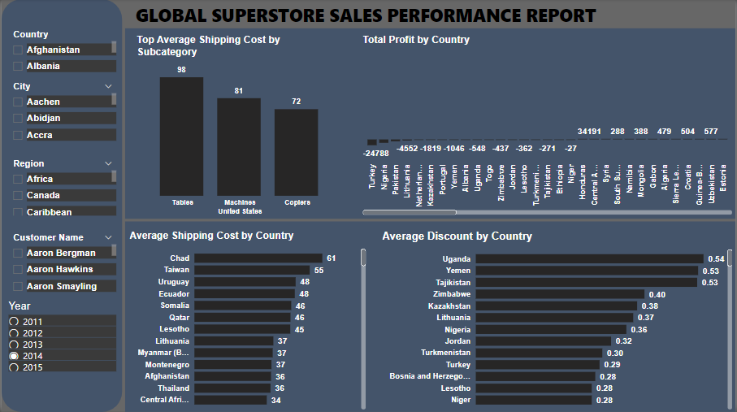
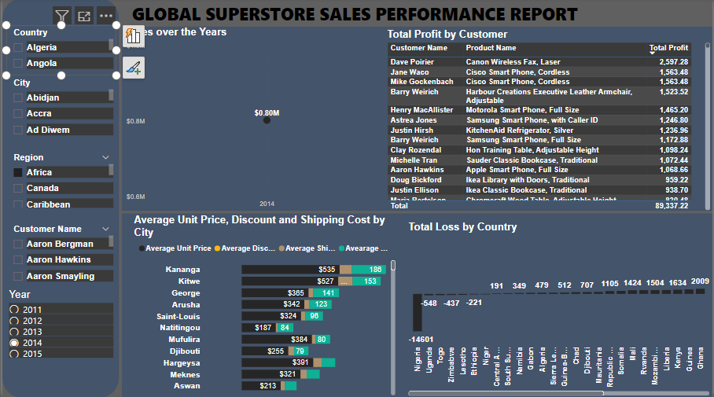

# Global Superstore Sales Report

## Introduction
This is a Power BI project on sales analysis of a store called **Global Superstore**. This project is to analyze and derive insights to answer crucial questions and help the store make data driven decisions.

## Problem Statement
1a)  What are the three countries that generated the highest total profit for Global Superstore in 2014?

b) For each of these three countries, find the three products with the highest total profit. Specifically, what are the products’ names and the total profit for each product? 
2a) Identify the 3 subcategories with the highest average shipping cost in the United States.

3a) Assess Nigeria’s profitability (i.e., total profit) for 2014. How does it compare to other African countries? 

b) What factors might be responsible for Nigeria’s poor performance? You might want to investigate shipping costs and the average discount as potential root causes.

4a) Identify the product subcategory that is the least profitable in Southeast Asia. Note: For this question, assume that Southeast Asia comprises Cambodia, Indonesia, Malaysia, Myanmar (Burma), the Philippines, Singapore, Thailand, and Vietnam.

b) Is there a specific country in Southeast Asia where Global Superstore should stop offering the subcategory identified in 4a? 

5a) Which city is the least profitable (in terms of average profit) in the United States? For this analysis, discard the cities with less than 10 Orders.

b) Why is this city’s average profit so low?

6a) Which product subcategory has the highest average profit in Australia? 

7a) Who are the most valuable customers and what do they purchase?

## Skills / Concept Demonstrated:

The following Power Bi concept were applied:
- DAX,
- Quick Measure, 
- Filters, 
- Data Modelling, 
- Page Navigator,
- Tooltips,
- Buttons

## Data Modelling

Manually connected tables resulting in a star schema model. The **Sales** is the fact table of the model. The remaining 5 tables; **Customer**, **Order**, **Product**, **Shipping**, **Calendar** tables are connected to the **Sales** table using the **Many-to-Many relationship**.  

## Data Analysis and Visualization

The report comprises 5 pages capturing so many details and presented in a way that’s easily accessible, providing decision-makers with a clear and up-to-date view of the company’s situation.

You can interact with the report here [here] (Link to the powerbi service)

1. From the dashboard, it is observed that the best performing product across all countries is **Canon imageCLASS 2200 Advanced Copier,** it's sub-category is  **Copier.**

2. Total Revenue made for each year = **61.82M**. This showss that there hav enot been any improvement in sales for the past 5 years.

3. The highest sales is generated in the North America region with **186,078.83 dollars.**

In 2014, it is observed that the three countries that generated the highest total profit for Global Superstore were:
- United States: $186,078.83
- Australia: $81,908.83
- France: $7,472.13

The top three products for each country are:
1. United States
- Canon imageCLASS 2200 Advanced Copier ($13,438.96)
- Ibiko EPK-21 Electric Binding System ($6,274.77)
- Fellowes PB500 Punch Plastic Comb ($6,227.85)

2. Australia
- Canon imageCLASS 2200 Advanced Copier ($11,759.97)
- Hewlett-Packard LaserJet 3310 Copier ($2,591.96)
- Breville Refrigerator, White ($1,692.00)

3. France
- SAFCO Executive Leather Armchair ($3,116.61)
- 3D System Cube Printer, Second Generation Magenta ($2,365.98)
- Hoover Stove, Red ($1,984.54)

In the United States, it is boldy seen that the top three subcategories with the highest average shipping costs are:
- Tables: $98
- Machines: $81
- Copiers: $72
This suggests that heavy or bulky items such as tables and machines tend to have higher shipping costs, which could impact profitability or pricing strategies.🙂

Looking closely at  your right-hand side of the dashboard, you would notice that Nigeria experienced a total loss of **-$14,601.30 dollars** in profit, reflecting a broader trend of underperformance by African countries compared to top-performing regions globally

The Contributing Factors to Nigeria's Low Profitability could be:
1. High Discounts (0.36 average)
- Nigeria offers one of the highest average discounts, likely to stimulate sales. However, while this strategy may increase order volumes, it negatively impacts overall profitability.

2. Shipping Costs
African nations face higher shipping costs due to:
- Poor infrastructure: Limited transport networks increase logistical challenges.
- Elevated import costs: Tariffs and taxes contribute to higher expenses.
- Shipping inefficiencies: These reduce cost-effectiveness and erode profit margins for goods shipped to Nigeria.

3. Market Dynamics
Economic conditions:
- Lower purchasing power in Nigeria may necessitate higher discounts to attract customers, reducing profit margins.
- Competitive pressures: A reliance on low-margin products in Nigeria could be driving the country's underperformance.

